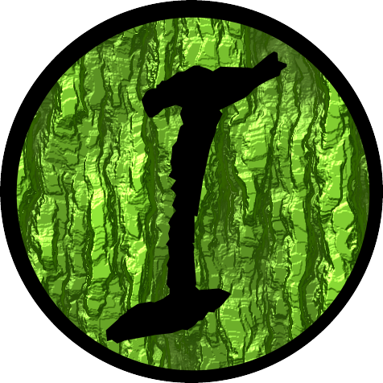

  

  Randomizer mod for <a href="https://github.com/Legend-of-Dragoon-Modding/Severed-Chains">Severed Chains</a>

# Soa sowed the seed
Randomize character and monster stats, change character and Dragoon elements, shuffle shop contents, and customize party availability. Choose a seed and tune individual options to shape your challenge, from a familiar adventure with QoL fixes to an Ironmon-inspired run.

Start with the included default configuration, then customize it through Irongoon's in-game settings. Irongoon and Severed Chains provide the configuration tools and game-data tables you need; no external config builder is required.

See the [Wiki Config Reference](https://github.com/Ink230/irongoon/wiki/Config-Reference) for individual settings, use the optional config builder at [dragoonmods.com](https://dragoonmods.com/), or configure a preset in-game.

# Builds & Releases

### [Latest Irongoon Build](https://github.com/Ink230/irongoon/releases/tag/irongoon-latest)

- Built from Irongoon `main` against the latest [Severed Chains `main`](https://github.com/Legend-of-Dragoon-Modding/Severed-Chains)
- Download `irongoon-v<version>.zip` and extract it into SC's `mods` directory; SC is installed separately
- Remove the previous Irongoon JAR and back up your configuration before replacing the `irongoon` folder

### [Latest Irongoon Future](https://github.com/Ink230/irongoon/releases/tag/irongoon-future)

- Experimental builds from `main.future`, requiring SC `main.spike-testing`; expect breaking changes
- Download the `sc-modified-irongoon-<platform>.zip` bundle for your platform to get the matching SC build with Irongoon already installed
- Extract a platform bundle into a new directory and place your disc images in `isos`
- SC's upstream updater can replace the experimental engine changes and does not update Irongoon

### [Stable Releases](https://github.com/Ink230/irongoon/releases/latest)

- Use a stable release with the SC version specified in its release notes; the rolling Latest and Future builds are prereleases
- SC RB3 compatibility: the pinned Irongoon version is still TBD

# Irongoon Settings

Customize individual randomization options in-game or load a YAML profile. On current `main`, settings are selected in this order:

1. **Campaign settings**: an existing campaign's saved settings snapshot is authoritative, including when restored through a Severed Chains config preset
2. **YAML profiles**: when starting without a snapshot, Irongoon tries the remembered profile if enabled, then `default-ig.yaml`, then other valid `*-ig.yaml` profiles in filename order under `mods/irongoon/configs/`
3. **Legacy configuration**: if no profiles are available, Irongoon uses `mods/irongoon/config.yaml`, which is included in the mod download
4. **Built-in defaults**: if no usable configuration is available, Irongoon uses its built-in Blueprint settings

In the in-game editor, **Use settings** applies your choices to the campaign; saving a profile makes those settings reusable. Editing a YAML file does not automatically replace settings already saved into a campaign. Older campaigns without a snapshot migrate from `config.yaml` first when that file exists.

For option names, modes, and examples, see the [Config Reference](https://github.com/Ink230/irongoon/wiki/Config-Reference) and [Config Template](https://github.com/Ink230/irongoon/wiki/Config-Template).

Addition and Dragoon-spell randomization are currently found in the Latest Irongoon Future build.

# Game data sources

Game data provides the starting values that your randomizer settings transform. Irongoon selects a source separately for each dataset:

- **Severed Chains** supplies monster stats directly
- **Bundled CSV tables** supply character and dragoon progression, addition hits, and addition unlock levels where SC does not expose a complete table
- **CSV overrides** let you supply fixed data by enabling `csvDataOverrides: TRUE` in your active configuration and placing matching files in `mods/irongoon/irongoon-data/`

With overrides disabled, character, dragoon, and monster tables also receive live updates from SC events after higher-priority mods have modified them. With overrides enabled, a matching CSV becomes a fixed source for that dataset; missing files follow the normal source selection. An invalid override reports an error instead of silently falling back.

Recognized filenames are `scdk-character-stats.csv`, `scdk-dragoon-stats.csv`, `scdk-monster-stats.csv`, `scdk-addition-stats.csv`, and `scdk-addition-unlock-levels.csv`. The default download includes these tables, so editing game data is optional.

We try to develop Irongoon to be as mod-friendly and as mod-compatible as possible.

# Irongoon Rules
The [Irongoon Rules](https://gist.github.com/Ink230/76197fd8251de5e0927d99077e0c1124) is a WIP goal of capturing the Ironmon essence.

Some rules are currently impossible, not implemented, or need further discussion on their worth.

# Contributing

Anyone is welcome to contribute via Pull Requests or ideas on [Discord](https://discord.gg/legendofdragoon).

# Credits / Resources

### [Monoxide](https://github.com/LordMonoxide)

- Creating Severed Chains

### [Zychronix](https://github.com/Zychronix)

- Compiling and maintaining the various LoD stats in use by the community

### [Ironmon 101](https://gist.github.com/valiant-code/adb18d248fa0fae7da6b639e2ee8f9c1)

### [Community LoD Discord](https://discord.gg/rQWXgK5)
